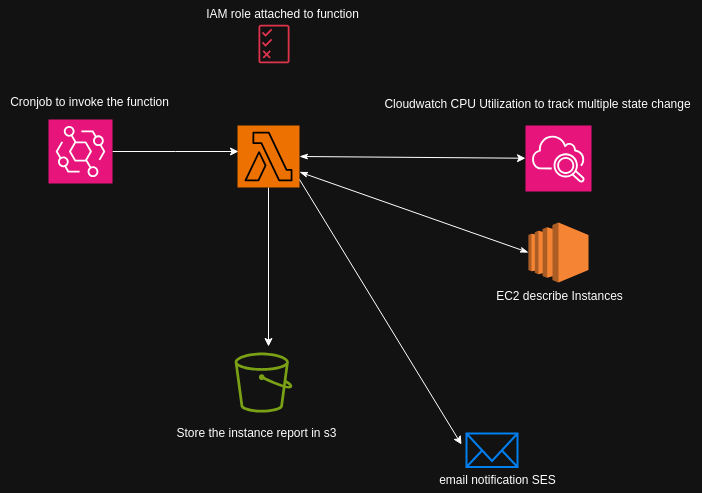

## Design



# AWS Lambda Function for EC2 Runtime Report

This AWS Lambda function calculates the cumulative runtime of EC2 instances over a specified period, generates a report, saves it to an S3 bucket, and sends an email notification via SES.

## Important

- **Tweak the `HOUR_THRESHOLD` and `LOOKBACK_DAYS` variables in the Lambda function code to suit your requirements.** These variables control the minimum runtime for reporting and the period over which the runtime is calculated, respectively.

## Prerequisites

- AWS account with necessary permissions
- AWS CLI configured with appropriate credentials
- Python 3.x

## Setup Instructions

1. **Install dependencies:**

    ```sh
    pip install -r requirements.txt
    ```

2. **Set environment variables:**

    Ensure the following environment variables are set in your Lambda function configuration:

    - `S3_BUCKET`: Your S3 bucket name
    - `S3_KEY`: S3 key path for the report
    - `REGION`: AWS region
    - `SENDER_EMAIL`: Verified email in SES
    - `RECIPIENT_EMAIL`: Recipient email

3. **Check instances for a specific region:**

    To check instances for a specific region, set the `INSTANCE_REGION` variable in the Lambda function code to the desired region name. If you want to check instances across all regions, leave it blank (`""`).

4. **Verify SES identity and create configuration set:**

    Ensure that the email addresses used for `SENDER_EMAIL` and `RECIPIENT_EMAIL` are verified in SES. Additionally, create a configuration set in SES.


## Permissions

To allow the Lambda function to execute properly, you need to attach the following policies to the Lambda execution role:

1. **S3 Access:**

    ```json
    {
        "Effect": "Allow",
        "Action": [
            "s3:PutObject",
            "s3:GetObject"
        ],
        "Resource": "arn:aws:s3:::<your-s3-bucket>/*"
    }
    ```

2. **CloudWatch Access:**

    ```json
    {
        "Effect": "Allow",
        "Action": [
            "cloudwatch:GetMetricStatistics"
        ],
        "Resource": "*"
    }
    ```

3. **SES Access:**

    ```json
    {
        "Effect": "Allow",
        "Action": [
            "ses:SendEmail",
            "ses:SendRawEmail"
        ],
        "Resource": "*"
    }
    ```

4. **EC2 Access:**

    ```json
    {
        "Effect": "Allow",
        "Action": [
            "ec2:DescribeInstances",
            "ec2:DescribeRegions"
        ],
        "Resource": "*"
    }
    ```

## Event Scheduler

To invoke the Lambda function automatically, set up a CloudWatch Events rule (use console or CLI).:

1. **Create a CloudWatch Events rule:**

    ```sh
    aws events put-rule --name "EC2RuntimeReportSchedule" --schedule-expression "cron(35 13 * * ? *)"
    ```

2. **Add the Lambda function as the target of the rule:**

    ```sh
    aws events put-targets --rule "EC2RuntimeReportSchedule" --targets "Id"="1","Arn"="<your-lambda-function-arn>"
    ```

## Deployment
 To deploy the Lambda function, use console or CLI:
1. **Zip the Lambda function:**

    ```sh
    zip -r lambda_function.zip .
    ```

2. **Deploy the Lambda function:**

    ```sh
    aws lambda update-function-code --function-name <your-lambda-function-name> --zip-file fileb://lambda_function.zip
    ```

## Usage

The Lambda function will automatically execute based on the configured trigger. It will calculate the runtime of EC2 instances, generate a report, save it to S3, and send an email notification.
